# Rule-based 비전과 AI 비전의 표면 결함 검출 비교 스터디

### Comparative Study of Surface Defect Detection with Traditional Vision and AI Vision


---

## 1. 개요

공개 데이터셋인 NEU-DET을 활용하여 금속 표면 결함을 자동으로 검출하는 **비전 시스템의 원리를 이해하고 구현**하는 것을 목표로 하는 스터디 프로젝트이다.

이를 위해 다음 두 가지 접근 방식을 구현하였다.

- **전통적인 Rule-based 영상처리(OpenCV) 결함 검출 방식**
- **CNN-based 객체 인식 AI모델(YOLO) 결함 검출 방식**

두 방식에 대해 결함 검출 메커니즘과 처리 속도(FPS)를 비교하였으며, 산업 현장에서의 적용 관점에서 결과를 분석하였다.
정확도 평가는 데이터셋 특성상 정량적 지표보다는 정성적 결과 분석을 중심으로 수행하였다.

---

## 2. Project Structure

```
surface-defects-machine-vision-detection-comparison-study
├─01_OpenCV_Defects_Detection\   
│  ├─NEU-DET\                                    # NEU-DET 데이터셋
│  └─opencv_surface_defect_detection_test.py     # Rule-based 결함 탐지 테스트 코드
├─02_YOLO_Defects_Detection\
│  ├─NEU-DET_modified\                           # YOLO 학습 구조로 변환한 NEU-DET 데이터셋
│  ├─runs\detect\result_model\Wights\
│  │  └─best.pt                                  # 학습 결과 가중치
│  ├─convert_xml_to_yolo.py                      # NEU-DET의 XML데이터셋 TXT 변환 스크립트
│  ├─data.yaml                                   # 클래스 정의 및 데이터 경로 설정 파일
│  ├─train_yolo.py                               # YOLO 모델 학습 코드
│  └─yolo_surface_defect_detection_test.py       # 학습완료 YOLO 모델을 통한 결함 탐지 테스트 코드
├─assets\
└─README.md
```

---

## 3. 데이터셋: NEU-DET

강판 표면 결함 검출 실험을 위해 **NEU-DET** (Northeastern University Surface Defect Database) 공개 데이터셋을 활용하였다

NEU-DET 데이터셋은 열연 강판 표면에서 발생하는 대표적인 6가지 결함 유형의 이미지를 포함하고 있으며, 산업용 표면 결함 검출 연구에서 널리 활용되는 데이터셋이다.

**Dataset**:
https://www.kaggle.com/datasets/kaustubhdikshit/neu-surface-defect-database

**결함 종류:**

| Crazing                           | Inclusion                           | Patche                            |
| --------------------------------- | ----------------------------------- | --------------------------------- |
| 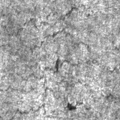 | 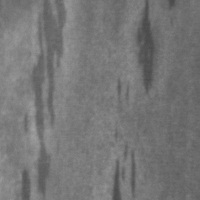 | 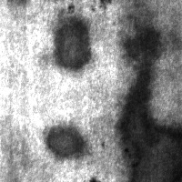 |

| Pitted Surface                          | Rolled-in Scale                          | Scratches                          |
| --------------------------------------- | ---------------------------------------- | ---------------------------------- |
| 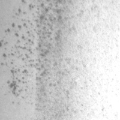 | 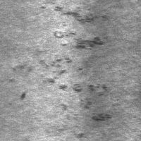 | 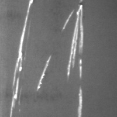 |

---

## 4. Approach 1: Rule-based 영상처리(OpenCV)

OpenCV 라이브러리를 활용하여 이미지 변환, 필터링, 이진화 등의 전통적인 영상처리 기법을 적용하여 결함 영역을 탐지하였다.

### 4.1 Environment

```
[Key Libraries]
Python Version : 3.12.0
OpenCV Version: 4.13.0
NumPy Version: 2.3.5

[Hardware]
CPU : AMD Ryzen 7 6800HS Creator Edition
GPU : NVIDIA RTX 3050 Laptop GPU (VRAM 4 GB)
RAM : 32 GB
```

### 4.2 Process Pipeline

`Grayscale` ➔ `Blurring` ➔ `Sharpening` ➔ `Thresholding` ➔ `Morphology` ➔ `Contour & Bounding Box (Detection)`

### 4.3 Process Visualization

**1. Grayscale**

   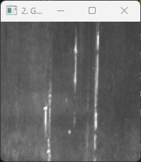     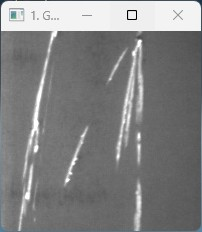

- RGB 3채널 이미지를 단일 채널의 Grayscale 이미지로 변환
- 데이터 크기를 줄여 연산 효율을 향상

**2. Blurring**

   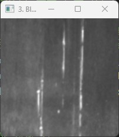     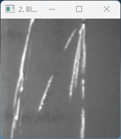

- 실제 공장에서는 조명 난반사, 렌즈의 먼지, 금속 표면의 미세한 질감 등으로 자잘한 노이즈 발생
- 불필요한 미세 노이즈를 결함으로 오검출(False Positive)하는 것을 방지
- 주변 픽셀값들을 평균화; 해당 테스트에서는 Gaussian Blur (가중 평균화) 적용

**3. Sharpening**

   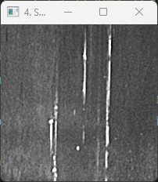     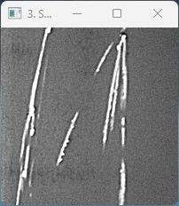

- 중앙 픽셀을 강화 & 주변 픽셀 약화로 결함 영역과 배경의 대비(contrast)를 강화

**4. Thresholding**

   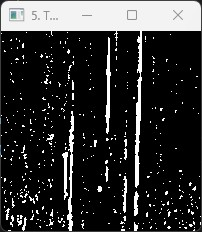     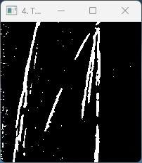

- 임계값을 통해 결함을 흰색(255), 배경을 검은색(0)으로 이진화
- 조도 불균형으로 인한 그림자 영역이 결함으로 검출되는 현상 방지
- Adaptive Thresholding 통해 일정 크기의 블럭 내부의 픽셀값 분포로부터 임계값을 자동으로 설정

**5. Morphology**

   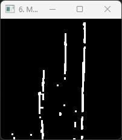     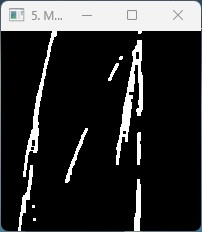

- 결함들을 하나의 결함 영역으로 병합
- **Opening** 적용
  - Erosion을 통해 **작은 흰색 노이즈를 제거**
  - 이후 Dilation을 통해 실제 결함 영역을 원래 크기로 복구
- **Closing** 적용
  - Opening 과정에서 **결함 객체가 분리될 수 있는 문제를 보완**
  - Dilation으로 객체를 확장하여 끊어진 부분을 연결
  - 이후 Erosion으로 영역을 원래 크기로 복구

**6. Contour & Bounding Box (Detection)**

   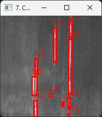     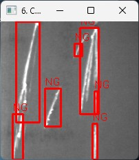

- **Contour detection**을 통해 결함 외곽선을 추출
- 검출된 contour를 기반으로 **Bounding Box**를 생성하여 결함 위치를 시각화
- 면적이 10픽셀 이상인 결함 객체만 유효한 결함으로 판단하여 필터링

### 4.4 Process Time

```
기준: train/images/scratches/ 이미지셋 

[Rule-based 결함 검출 성능 테스트 결과]
 총 테스트 이미지: 240 장
 평균 처리 시간: 0.50 ms / 장
 평균 FPS: 1981.56 FPS
```

---

## 5. Approach 2: CNN-based 객체 인식 AI (모델명: YOLO)

정제된 데이터를 기반으로 CNN 기반 객체 인식 AI 모델인 YOLO를 학습시켜 표면 결함의 특징을 자동으로 학습하고 검출하는 방식이다.
모델은 이미지로부터 결함의 형태, 패턴, 질감 등의 특징(feature)을 학습하여 결함 위치를 탐지한다.

### 5.1 Environment

```
[Key Libraries]
Python Version : 3.12.0
Ultralytics (YOLO) Version: 8.4.21
PyTorch Version: 2.6.0+cu124
Torchvision Version: 0.21.0+cu124

[Hardware]
CPU : AMD Ryzen 7 6800HS Creator Edition
GPU : NVIDIA RTX 3050 Laptop GPU (VRAM 4 GB)
RAM : 32 GB
```

### 5.2 Process Pipeline

  `Data Annotation` ➔ `Model Training` ➔ `Inference & Evaluation (Detection)`

### 5.3 Process Visualization:

**1. Data Annotation**

- 결함 위치와 크기 정보 지정 작업 수행
- NEU-DET 데이터셋에는 각 이미지에 대한 결함 위치 정보(annotation) 가 포함되어 있음
- NEU-DET 원본 데이터는 Pascal VOC(XML) 포맷으로 제공됨.
- `convert_xml_to_yolo.py` 스크립트 제작하여 XML 파일 내 Bounding Box 좌표를 YOLO 포맷 정규화 좌표 기반의 TXT 파일로 일괄 변환

**2. Model Training**

- `data.yaml` 에서 클래스 정의 및 데이터 경로 설정
- `train_yolo.py`에서 `epochs`, `imgsz`, `batch` 값 설정 & 실행

  ```
  epochs=100     # 전체 데이터셋 반복 학습 횟수. 
  imgsz=200      # 원본 데이터셋 해상도(200x200)에 맞추어 설정
  batch          # 한 번에 처리하는 이미지 수. GPU 메모리 사용량과 학습 안정성을 고려하여 16으로 설정
  ```

**3. Inference & Evaluation (Detection)**

- 훈련된 모델을 이용하여 결함 검출 테스트 수행

| Scratches                                                 | Crazing                                                                   |
| --------------------------------------------------------- | ------------------------------------------------------------------------- |
| 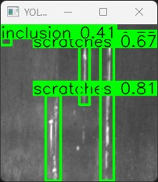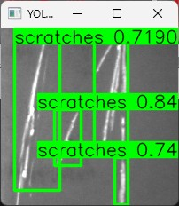 | 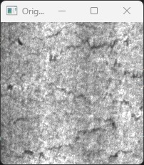 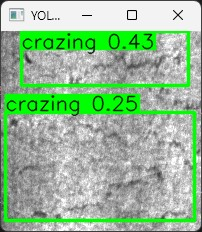 |

| Inclusion                                                                     | Patches                                                                   |
| ----------------------------------------------------------------------------- | ------------------------------------------------------------------------- |
| 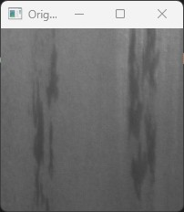 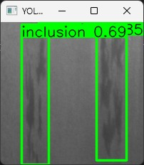 | 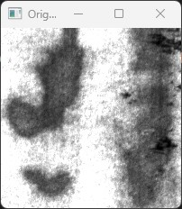 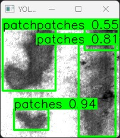 |

| Pitted Surface                                                                          | Rolled-in Scale                                                                             |
| --------------------------------------------------------------------------------------- | ------------------------------------------------------------------------------------------- |
| 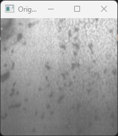 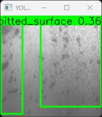 | 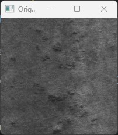 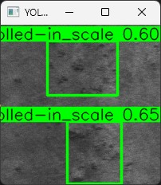 |

### 5.4 **Process Time**

```
기준: train/images/scratches/ 이미지셋 

[YOLO 결함 검출 성능 테스트 결과]
 총 테스트 이미지: 240 장
 평균 처리 시간: 21.83 ms / 장
 평균 FPS: 45.81 FPS
```

---

## 6. 분석

### System Comparison

|                                                  | Rule-based 영상처리 (OpenCV)                                                                           | CNN-based 객체 인식 AI (YOLO)                                                                                     |
| ------------------------------------------------ | ------------------------------------------------------------------------------------------------------ | ------------------------------------------------------------------------------------------------------------------ |
| **Average Process Time**                   | **0.50 ms / image<br />1981.56 FPS (240 Images)**                                                | **21.83 ms / image<br />45.81 FPS (240 Images)**                                                             |
| **불량 검출 분석 가능성 / Explainability** | - 불량 판정 사유 즉각적으로 확인 가능                                                                 | - 오검출(False Positive) 발생 시 왜 틀렸는지 원인 분석이 제한적<br />- 즉각적인 로직 수정 불가                     |
| **유지보수성 / Maintenance**               | - 재질, 조명의 각도, 결함종류 변화시 파라미터에 대해 지속적인 조정 필요                                | -  환경 변화시 새로운 데이터로 재학습하면 성능 개선 가능.<br />- 변화에 맞춘 데이터 관리와 모델 업데이트 과정 필요 |
| **강건성 / Robustness**                    | - 새로운 결함 유형이나 환경 변화에 대한 일반화 능력이 낮기에 환경 변화시 검출 성능이 크게 변할 수 있음 | - 다양한 데이터 학습을 통해 조명 변화, 반사, 노이즈 등 복잡한 환경에서도 비교적 안정적인 검출 가능                 |
| **도입 비용 / Deployment Cost**            | - 별도의 학습 과정이 필요 없으며 일반 CPU 환경에서도 동작 가능하여 초기 구축 비용이 낮음               | - 모델 학습을 위한 GPU 자원, 데이터 라벨링, 추론 환경 구축 등 초기 비용이 상대적으로 높음                          |

---

## 7. 결론

해당 프로젝트에서는 전통적인 Rule-based 영상처리 방식과 CNN-based 객체 인식 AI 방식을 각각 구현하고 성능을 비교 분석하였다. 실험 결과 다음과 같은 결론을 도출할 수 있었다.

**방식에 따른 Trade-off**

영상처리 방식은 약 1981 FPS의 높은 처리 속도를 보였으며, 검출 과정이 비교적 단순하고 직관적으로 설명 가능하다는 장점이 있다. 따라서 조명이나 촬영 환경이 충분히 통제된 단순 검사 공정에서는 매우 효율적인 방법임을 확인할 수 있었다. 반면 객체 인식 AI 방식은 상대적으로 낮은 처리 속도(약  45 FPS )를 보였지만, 다양한 결함 유형과 환경 변화에도 안정적인 검출 성능을 보이며 높은 강건성(Robustness)을 나타냈다.

**산업 현장 맞춤형 비전 시스템 설계**

실제 제조 현장에서는 도입 비용, 요구되는 처리 속도, 그리고 검사 환경의 통제 가능성 등 다양한 요소를 고려하여 적절한 기술을 선택해야 한다. 이러한 관점에서 영상처리 방식과 객체 인식 AI 방식은 서로 다른 장점을 가지며, 적용 환경에 따라 적절한 선택 또는 복합적인 하이브리드 접근이 필요함을 확인할 수 있었다.

**Learning outcomes**

본 프로젝트를 통해 이미지 전처리, 필터링, 형태학적 연산(Morphology) 등 전통적인 비전 파이프라인을 직접 구현함으로써 컴퓨터 비전 시스템이 이미지를 처리하고 해석하는 기본 원리를 이해할 수 있었다. 또한 전통적인 영상처리 방식과 객체 인식 AI 방식의 차이를 실험적으로 비교함으로써 문제 특성에 맞는 비전 시스템 설계의 중요성을 확인하였다.

---

## 8. Future Work

- YOLO을 활용한 Edge Device 기반 실시간 검사 시스템
- Hybrid defect detection pipeline 구현
- 다양한 조건 및 추가적인 실제 산업 환경데이터셋을 활용한 추가 검증
